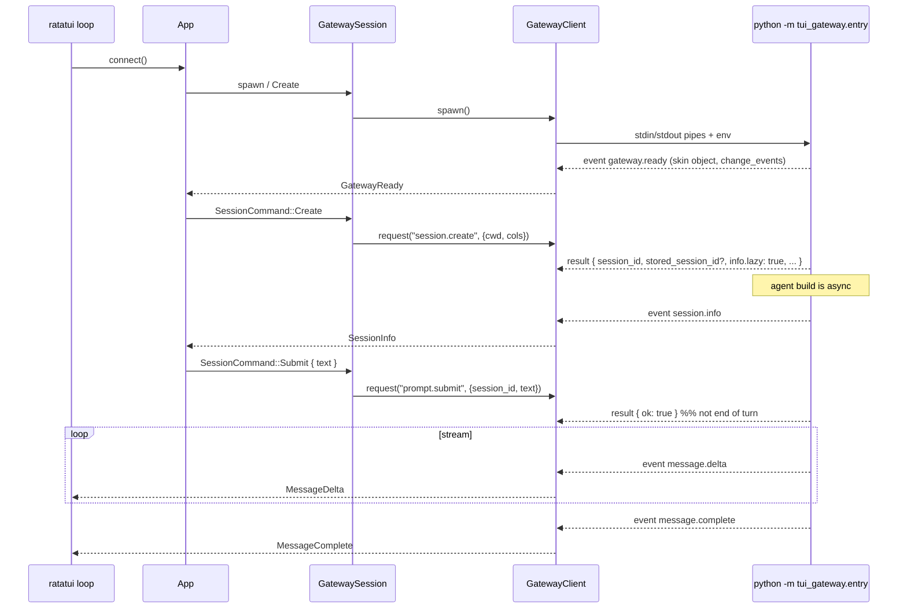
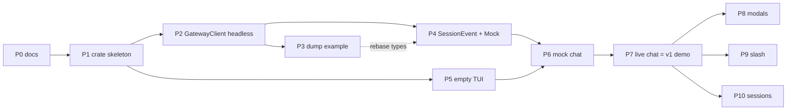

# hermes-rust — Planning & Architecture (Discussion Draft)

| Field | Value |
|-------|-------|
| **Title** | Native Rust + ratatui TUI host for Hermes `tui_gateway` |
| **Author** | TBD (discussion draft) |
| **Date** | 2026-08-22 |
| **Status** | **Draft — for discussion.** Nothing in this repo is implemented yet. |
| **Repo** | `/Users/inaki/repos/hermes-rust` (empty besides `docs/`) |
| **This file** | Canonical living document. Status SSOT until `PARITY.md` exists. **Never create `MIGRATION.md`.** |

**Read this as a plan we will argue about, not as a committed implementation.** Field names, spawn flags, and event payloads cited below were sampled from official Hermes docs and from `NousResearch/hermes-agent` `main` on 2026-08-22. They are a **starting hypothesis**. They must be re-verified with a live `python -m tui_gateway.entry` dump before we freeze `protocol.rs`.

**Frozen names (discussion default, see [Key Decisions](#key-decisions)):** Cargo package `hermes-rust`, binary `hermes-rust`, library `hermes_rust`, `publish = false`. The alias `hermes-tui` is **rejected** during dual-run.

---

## Overview

Hermes (Nous Research) is a Python agent runtime: tools, memory, skills, `~/.hermes` config, and the Ink TUI (`hermes --tui`) already exist. We are **not** cloning that repo into this one, and we are **not** reimplementing the agent.

This project is a **native Rust TUI that hosts** the official Python `tui_gateway` over **newline-delimited JSON-RPC 2.0 on stdio**. The Rust binary is a gateway *client* (renderer + input + process supervisor). Python remains the source of truth for sessions, tools, approvals, slash commands, and durable state.

The engineering practices we want — docs layout, library-first crate, `Screen`/`widget` split, mock+real session, dual-run binary name, incremental demo-able phases — come from `herald_v2` (`/Users/inaki/repos/RunLLM/src/herald_v2`). We copy the **practices**, not the product. Herald talks HTTP+WebSocket to a Herald backend and executes tools locally. Hermes-rust talks stdio JSON-RPC to a Python child and never executes Hermes tools itself.

Phased product:

| Phase | Meaning | Exit |
|-------|---------|------|
| **v0** | Connection layer + docs | Spawn → `gateway.ready` → `session.create` → `session.close` without calling a model. Opt-in `--prompt` is a *separate* dump. |
| **v1 demo** | Usable streaming chat | Transcript, sticky composer, status bar, interrupt. First live turn: spawn → ready → create → submit → stream. |
| **v1 product** | Ink-shaped host | Approval/clarify/sudo/secret modals, slash catalog, saved vs live session switcher. |
| **Later** | Out of v1 | Branch, subagents, images, spawn_tree, WebSocket attach, packaging as `hermes`. |

---

## Background & Motivation

### Why a Rust host

`hermes --tui` is TypeScript + Ink talking to `tui_gateway` (Python) over stdio JSON-RPC. That split is already the right architecture: the UI is a host, the agent is a child. A ratatui host can reuse that split and gain:

- A single native binary for the *UI* (Python still required for the agent).
- Immediate-mode redraw that fits streaming tokens, tool cards, and overlays.
- An async/sync boundary we already trust from herald_v2 (one Tokio runtime, sync ratatui loop, `mpsc` events).

We are **not** arguing “replace Python Hermes.” We are arguing “replace the Ink process that already sits on top of `tui_gateway`.”

### Current state of this repo

Empty besides `docs/`. No `Cargo.toml`, no `src/`, no tests. `hermes` was **not on PATH** in the environment that drafted this document. Design for a normal user install; discovery must **import-probe**, not hardcode a machine-specific Python, and must **never spawn `tui_gateway.entry` as a probe**.

### Pain we are designing against (from herald_v2, applied here)

herald_v2 burned time reconciling two status guides (`IMPLEMENTATION_GUIDE.md` vs `MIGRATION.md`). This repo is a greenfield *host*, not a port of Ink TSX, so there is nothing to migrate. **`PLAN.md` is the only implementation-status document until `PARITY.md` exists. Never create `MIGRATION.md`.** Later we add `ARCHITECTURE`, `STRUCTURE`, `BEST_PRACTICES`, `RUNNING`, then `PARITY` — and we will not let a second status file drift.

Other herald_v2 scars we take as constraints:

- God-files in `app.rs` / a giant chat screen. Split early.
- Blocking the UI thread on I/O. Never.
- Dual-run naming: a cargo bin named `hermes` would shadow the official launcher. Do not do that.
- Dual-run *state*: two gateways on one `HERMES_HOME` still race SQLite even if Rust never opens those files. Sequential use only in v1.
- Protocol types that rot against the real gateway. Treat `tui_gateway` + live captures as source of truth.

### What we actually sampled (honest inventory)

| Source | Status | Use |
|--------|--------|-----|
| Official programmatic-integration docs | Read 2026-08-22 | Protocol choice, method catalog, rewind rules, event names |
| `ui-tui/src/gatewayClient.ts` on GitHub `main` | Read (not in this repo) | Spawn, env, JSON-RPC framing, timeouts, kill |
| `tui_gateway/entry.py` on GitHub `main` | Read | `gateway.ready` payload, stdin loop, signals, shutdown grace |
| `tui_gateway/methods_prompt.py` / `methods_session.py` | Sampled | `prompt.submit` truncation, `session.create` params |
| `ui-tui/src/gatewayTypes.ts` | Read | Typed event/result shapes (hypothesis) |
| `ui-tui/src/app/createGatewayEventHandler.ts` | Sampled | Approval overlay does **not** read `request_id`; sudo/secret expire by id; clarify has no `*.expire` |
| Live `hermes --tui` / local `tui_gateway.entry` | **Not run** — `hermes` missing on PATH here | Required protocol spike before freezing types |
| User skeleton (spawn → ready → create → submit → print events) | Notes only | Connection-layer shape, not the TUI |

---

## Goals & Non-Goals

### Goals

1. Host official Hermes `tui_gateway` over stdio JSON-RPC 2.0.
2. Keep a working Hermes Python install as the only agent dependency.
3. Ship a ratatui TUI that is demo-able at every phase (headless RPC → empty TUI → mock chat → live chat).
4. Reuse herald_v2 *engineering* practices listed in [Practices to transfer](#practices-to-transfer).
5. **Dual-run contract (v1):** sequential use beside `hermes --tui` is supported; **simultaneous two-gateway use against one `HERMES_HOME` is unsupported** (at-user-risk). The Rust host does not write Hermes config, and the cargo bin is not named `hermes`. See [Data Model](#data-model-changes).
6. Treat protocol field paths as verified only after a live JSON dump.

### Non-goals (v1)

- Cloning `hermes-agent` into this repo, or vendoring Python.
- Reimplementing the agent, tools, MCP, memory, skills, or `~/.hermes` config format.
- A local `tool_executor` / kubectl passthrough / MCP client (tools run inside Python).
- Herald product surfaces: credentials/device-code auth, predictive alerting, risk Home, system-architecture graph.
- Pixel-perfect 1:1 port of Ink TSX screens from `ui-tui/` (we do not have that tree checked out; UI is designed from the gateway event model, inspired by `hermes --tui` behavior).
- Packaging as a drop-in `hermes` binary, Homebrew, or competing installer.
- WebSocket attach (`HERMES_TUI_GATEWAY_URL` / `tui_gateway/ws.py`) as a v1 requirement. Stdio spawn is the path. Attach is an explicit later option.
- Sidecar mirror (`HERMES_TUI_SIDECAR_URL`): **ignore if set.** Do not connect.
- ACP (`hermes acp`) as the TUI transport. ACP is for IDEs.
- The OpenAI-compatible API server as the TUI transport. That is for HTTP frontends.
- Session branch, subagent panel, `image.attach`, `spawn_tree.*`, voice/wake-word, billing step-up UI.
- Inventing `approval.expire` / `clarify.expire` (those events are not in the official catalog).
- Creating `docs/MIGRATION.md`.

### Anti-patterns we will not copy from herald_v2

| Herald-v2 thing | Why it does not transfer |
|-----------------|--------------------------|
| `tool_executor.rs`, MCP stdio, kubectl passthrough | Hermes Python already runs tools |
| `credentials.rs` / device-code / `api.rs` HTTP | No Herald backend; no parallel auth store |
| `predictive_alerting/`, `proactive.rs`, Home risks | Herald product, not Hermes |
| `system_arch.rs` | Herald product |
| Shipping the cargo bin as `herald` (or here, `hermes`) during dual-run | Would shadow the official launcher |
| Two status docs that disagree | This file is the single status doc until **`PARITY.md`**. Never `MIGRATION.md`. |
| Assuming Ink TSX is the UI spec | We do not have `ui-tui` checked out; gateway events are the spec |
| M0 “mock investigation before real WS” as the *connection* order | herald_v2 could mock the backend. Our hard risk is spawn+JSON-RPC, so the **connection layer** is live-first; **screens** are mock-first after a provisional `SessionEvent`. |

---

## Practices to transfer

Mapped from `herald_v2/docs/{ARCHITECTURE,STRUCTURE,BEST_PRACTICES,MIGRATION}.md` and the crate itself. `DECISION.md` / `PARITY-PLAN.md` / `INK-VS-RATATUI.md` were also read (go/no-go bar, remaining-gap sequencing, Ink vs ratatui scrollback). They are not a 1:1 template for this host.

| # | Practice | herald_v2 evidence | hermes-rust application |
|---|----------|--------------------|-------------------------|
| 1 | `docs/` as living source of truth | `docs/ARCHITECTURE.md`; `MIGRATION.md` became status SSOT after two guides disagreed | Start with **this** `PLAN.md`. Later: ARCHITECTURE, STRUCTURE, BEST_PRACTICES, RUNNING, then **PARITY** (status SSOT). **Never create `MIGRATION.md`.** |
| 2 | Library-first | `src/lib.rs` holds logic; `src/main.rs` is clap + logging + `run_tui` | Same. Package `hermes-rust`, lib `hermes_rust`. `main.rs` stays thin. |
| 3 | Separation | `ui/widgets/` pure-ish, `ui/screens/` `Screen` trait, `app/` orchestration, domain at crate root | `gateway`, `protocol`, `session`, `theme`, `discover` at crate root; UI under `ui/`. |
| 4 | God-file hygiene | `app/` and `ui/screens/investigation/` are module trees; state in `mod.rs` so children see private fields | Split `app/` and the chat screen the same way from day one. |
| 5 | Theme SSOT | `theme.rs` only; no raw `Rgb` in widgets | `theme.rs` only. |
| 6 | Async/sync boundary | One Tokio runtime in `app/run.rs`; ratatui loop uses `crossterm::event::poll`; `Handle::spawn` + `mpsc` | Same. **Never** block the UI thread on gateway I/O or process wait. |
| 7 | Session abstraction | `LiteSession` + `MockSession` share `SessionEvent` **and** App drives `connect`/`submit`/`Cancel` on the session object | **Events and commands.** `SessionApi` + `SessionCommand` implemented by both live and mock. Chat screen drains `SessionEvent` only. `App` (not the screen) may match mock vs live **at construction**. |
| 8 | Dual-run safety | cargo bin `herald-v2`, not `herald`; scripts can sandbox `HERALD_HOME` | cargo bin **`hermes-rust`**. Do not write a competing `~/.hermes` format. Sequential dual-run only (see Goals §5). |
| 9 | Demo-able at every step | **Evidence:** M0 was a mock investigation *before* real WS, because the backend was a remote Herald gateway. | **Application (inverted for the connection layer):** headless JSON-RPC smoke (no model) → empty TUI → mock chat → live chat. Screens do not wait on a Hermes+API-key machine. |
| 10 | Typed protocol with a sync comment | `protocol.rs` cites `herald_tui/lib/ws-types.ts` | `protocol.rs` cites `tui_gateway` + `captures/`. Re-verify on Hermes upgrades. Provisional types from `gatewayTypes.ts` until the dump. |
| 11 | Friendly user-facing errors | `user_messages` + file log; no stack traces in the TUI | Same. File log for diagnosis; TUI shows actionable copy. `user_messages.rs` lands when live errors exist (PR 7 / polish), not in the skeleton. |
| 12 | Slash commands over letter hotkeys | BEST_PRACTICES §2: letters steal keystrokes from the prompt | Composer is text-first. `/` opens the menu. `q` to quit is **PR 5 only**. From PR 6: **Esc → interrupt, Ctrl+C → quit.** |
| 13 | `#[allow(dead_code)]` + comments | Ported-but-unwired items | Same until a method/event is exercised; then remove the allow. |
| 14 | `pub(crate)` until public is needed | BEST_PRACTICES §9 | Same. |

Concrete types (shape, not Herald variants):

- `GatewayClient` — spawn + JSON-RPC write/read. The user’s skeleton is this layer, **not** the TUI.
- `SessionEvent` — UI-facing enum the chat screen drains.
- `SessionApi` / `SessionCommand` — UI-facing *control* surface. Both mock and live implement it.
- `Screen` / `ScreenAction` / `CurrentScreen` — same trait pattern as `herald_v2/src/ui/screens/mod.rs` (including `handle_mouse` default no-op).

---

## Protocol choice: why `tui_gateway`

Hermes ships three programmatic surfaces ([official docs](https://hermes-agent.nousresearch.com/docs/developer-guide/programmatic-integration)):

| Protocol | Transport | Best for |
|----------|-----------|----------|
| **ACP** | JSON-RPC stdio | IDEs that already speak Agent Client Protocol |
| **TUI gateway** | JSON-RPC stdio (or WebSocket) | Custom hosts that want sessions, slash commands, approvals, streaming |
| **API server** | HTTP + SSE | OpenAI-compatible web frontends |

**Recommendation: stdio `tui_gateway`.** That is the protocol `hermes --tui` already speaks. It exposes `prompt.submit`, session lifecycle, `commands.catalog` / `command.dispatch`, and the approval/clarify/sudo/secret prompts a TUI must render. ACP is a worse fit (IDE-shaped tool blocks, not slash/approvals). The API server is a worse fit (HTTP, no native TUI event model).

WebSocket (`tui_gateway/ws.py`, `HERMES_TUI_GATEWAY_URL` attach in official `GatewayClient`) is **out of v1 scope**. The official client already supports attach-vs-spawn; we can add attach later without changing `SessionEvent`. Do not start there. `HERMES_TUI_SIDECAR_URL`, if present in the environment, is **ignored**.

---

## Proposed Design

### Mental model

```
┌─────────────────────────────────────────────────────────────┐
│  hermes-rust (this repo)                                    │
│  ratatui loop (sync) ── mpsc ── Tokio tasks                 │
│       │  ScreenAction                                       │
│       ▼                                                     │
│  App  ── SessionCommand ── SessionApi                       │
│       │                       │                             │
│       │  SessionEvent         ├─ GatewaySession (live)      │
│       │                       └─ MockSession    (dev)       │
│       ▼                                                     │
│  Chat screen (no mock/real branch)                          │
└───────┼─────────────────────────────────────────────────────┘
        │ spawn(python, ["-u", "-m", "tui_gateway.entry"])
        ▼
┌─────────────────────────────────────────────────────────────┐
│  Official Hermes Python                                     │
│  tui_gateway  →  AIAgent, tools, memory, ~/.hermes          │
└─────────────────────────────────────────────────────────────┘
```

The Rust process **does not** interpret Hermes config except insofar as the child does. We may read env vars to *find* Python. We do not invent a parallel config schema.

### Recommended crate layout (empty repo → this)

Names below are **frozen** (package `hermes-rust`, bin `hermes-rust`, lib `hermes_rust`). Files marked *later* are not in PR 1.

```
hermes-rust/
├── Cargo.toml                 # name = "hermes-rust", default-run = "hermes-rust", publish = false, edition = "2021"
├── .gitignore                 # /target, /captures, *.log  (PR 1)
├── README.md                  # later; pointer to docs/
├── docs/
│   ├── README.md              # index (exists)
│   └── PLAN.md                # this file (status SSOT until PARITY.md)
├── captures/                  # gitignored live JSON dumps from the protocol spike
├── examples/
│   └── dump_gateway.rs        # THE dump entrypoint (PR 3). Default: ready+create+close, no model.
├── tests/
│   └── fixtures/              # redacted captures + approval fixtures (PR 3 / PR 8)
└── src/
    ├── main.rs                # clap + logging + dispatch
    ├── lib.rs                 # modules + re-exports
    ├── cli.rs
    ├── logging.rs             # rotating file log under ~/.hermes-rust (not ~/.hermes)
    ├── paths.rs               # HermesRustPaths — hardcoded state dir (no `dirs` crate)
    ├── theme.rs               # PR 5
    ├── discover.rs            # PR 2 — import probe only
    ├── protocol.rs            # typed JSON-RPC; provisional in PR 2, pinned in PR 3
    ├── gateway.rs             # GatewayClient: spawn, line I/O, pending RPCs (PR 2)
    ├── session.rs             # SessionApi, SessionCommand, GatewaySession, MockSession (PR 4)
    ├── user_messages.rs       # later (PR 7 / polish) — not in the skeleton
    ├── app/
    │   ├── mod.rs             # App state
    │   ├── run.rs             # terminal lifecycle + event loop
    │   ├── dispatch.rs        # ScreenAction → SessionCommand
    │   ├── input.rs
    │   ├── render.rs
    │   └── tick.rs            # drain SessionEvent
    └── ui/
        ├── mod.rs
        ├── keys.rs
        ├── widgets/           # composer, slash menu, tool card, spinner, overlays
        └── screens/
            ├── mod.rs         # Screen, ScreenAction, CurrentScreen
            └── chat/          # module tree, state in mod.rs
```

Follow herald_v2: state types live in `mod.rs` so child modules can touch private fields without `pub`. `impl Screen for Chat` stays in `mod.rs` as one-line delegations (`render_screen`, `on_key`, `tick_screen`, …).

### Suggested dependencies (v0/v1)

Aligned with herald_v2's TUI stack, **minus** HTTP/WebSocket/OTEL/`dirs`/`uuid`:

| Crate | Why |
|-------|-----|
| `ratatui` 0.30 | Immediate-mode TUI |
| `crossterm` | Input, raw mode, alternate screen, `Event::Resize` |
| `tokio` (`rt-multi-thread`, `process`, `io-util`, `sync`, `macros`, `time`) | Child process + channels. **`signal` is not required** — window resize comes from crossterm; we do not put the child in our process group. |
| `serde` / `serde_json` | JSON-RPC |
| `clap` | CLI |
| `anyhow` / `thiserror` | Errors |
| `tracing` / `tracing-subscriber` | Diagnostics (file, not stderr during alt-screen) |
| `which` | Discover `hermes` on PATH for diagnostics |

**Not in v1:** `reqwest`, `tokio-tungstenite`, OpenTelemetry, `pulldown-cmark` (markdown widget later), **`dirs`** (path policy is hardcoded — see [Log & state directory](#log--state-directory)), **`uuid`** (request ids are Ink’s `r{n}` scheme).

### Log & state directory

**Decided for PR 1** (closes former OQ 7):

| Platform | Path |
|----------|------|
| Unix (macOS + Linux) | `~/.hermes-rust/` |
| Windows | `%LOCALAPPDATA%\hermes-rust\` |

```
~/.hermes-rust/                 # Unix; %LOCALAPPDATA%\hermes-rust on Windows
  logs/hermes-rust.log          # rotating, 10 MB × 5 (herald_v2 logging.rs numbers), mode 0600
```

Hardcode via `paths.rs` (`HermesRustPaths`). Do **not** use the `dirs` crate: `dirs::state_dir()` on macOS is `~/Library/Application Support`, which is not the discoverable `~/.hermes-rust` we want. Never write under `~/.hermes`.

### Core types (proposed)

Provisional until the protocol spike. Field names marked *hypothesis* come from official `gatewayTypes.ts` / `methods_*.py`.

#### GatewayClient contracts

Copy Ink `request` / `dispatch` semantics unless a dump contradicts them:

- **Request ids:** `r{n}` (`r1`, `r2`, …). Not UUIDs.
- **Pending map** keyed by that id. Timeout = `HERMES_TUI_RPC_TIMEOUT_MS` if set, else **120s**, floored at **30s** (Ink: `Math.max(30000, …)`).
- **Startup timer:** `HERMES_TUI_STARTUP_TIMEOUT_MS` if set, else **15s**, floored at **5s**.
- **Unknown result `id`:** ignore (Ink does). Do not panic.
- **JSON-RPC parse-error responses** with `"id": null` from `entry.py` are **RPC errors**, not events. Do not feed them to `asGatewayEvent`.
- **`prompt.submit` RPC completion ≠ end of turn.** The result is typically `{ ok?: true }` (hypothesis) at turn *start*; deltas continue on the event stream until `message.complete`. The session task must not treat the RPC reply as `MessageComplete`.
- **Concurrent `request()` during a stream is allowed** (interrupt, resize, catalog). Serialize writes to stdin; do not block the event reader.
- **Stdout line cap:** **1 MiB**. Larger line → drop, log, emit a local `gateway.protocol_error`. (Stderr: copy Ink’s 4096-byte truncate. Protocol-error *preview* in logs: 240 chars.)
- **UTF-8:** decode lines as UTF-8; Python writes `ensure_ascii=False`. Invalid UTF-8 → protocol_error, do not kill the child.
- **Backpressure:** event channel capacity **100** (live) / **64** (mock), matching herald_v2. If full, drop *non-terminal* deltas and count them in the log; never drop `message.complete`, approval/sudo/secret/clarify, or child-exit.
- **`take_events()` once.** After `GatewaySession` wraps the client, the session owns the receiver. A second take returns `None`.
- **`kill_on_drop` is the safety net**, not the happy path (see [Shutdown](#shutdown-avoid-zombies)).

```rust
/// Connection layer only. Not the TUI.
pub struct GatewayClient { /* child, stdin, stdout lines, pending RPCs */ }

impl GatewayClient {
    pub async fn spawn(opts: SpawnOptions) -> Result<Self, GatewayError> { unimplemented!() }
    pub async fn request(&self, method: &str, params: Value) -> Result<Value, GatewayError> { unimplemented!() }
    /// Take the raw-event receiver once. Subsequent calls return None.
    pub fn take_events(&mut self) -> Option<mpsc::Receiver<GatewayEvent>> { unimplemented!() }
    /// Happy-path teardown: stdin EOF, optional process.stop, grace, then kill+wait.
    pub async fn shutdown(&self) -> Result<(), GatewayError> { unimplemented!() }
}
```

#### Session control surface (the half herald_v2 actually uses)

Chat screens emit `ScreenAction`. **`App` translates those into `SessionCommand`.** The screen never names `GatewaySession` or `MockSession`. `App` may match live vs mock **only at construction** (`--dev` → `MockSession`).

```rust
/// Commands App sends to the session task. Both live and mock consume this.
pub enum SessionCommand {
    Create { cwd: Option<String>, cols: u16 },
    Submit { text: String },           // ordinary: {session_id, text} only — no truncate_*
    Interrupt,                         // Esc → session.interrupt (not Ctrl+C)
    Resume { session_id: String, cols: u16 }, // saved transcript → session.resume
    Activate { session_id: String },   // already-live in this process → session.activate
    Dispatch { command: String },      // slash → command.dispatch
    RespondApproval { choice: String, request_id: Option<String> },
    RespondClarify { request_id: String, answers: Value },
    RespondSudo { request_id: String, /* secret not logged */ },
    RespondSecret { request_id: String, /* secret not logged */ },
    Resize { cols: u16, rows: u16 },   // → terminal.resize
    Close,
    Shutdown,
}

pub trait SessionApi {
    fn send(&self, cmd: SessionCommand);
    /// Take the UI event receiver once (capacity: 100 live / 64 mock).
    fn take_events(&mut self) -> Option<mpsc::Receiver<SessionEvent>>;
}

/// App holds this. Construction is the only mock/live branch.
pub enum SessionKind {
    Live(GatewaySession),
    Mock(MockSession),
}
```

`GatewaySession` wraps `GatewayClient` and translates wire events into `SessionEvent`. `MockSession` emits the same enum on a timer. Both return `(Self, Receiver<SessionEvent>)` like herald_v2, **or** implement `take_events()`; pick one constructor style in PR 4 and stick to it (`take_events` is the ownership-safe default).

#### SessionEvent (v1)

```rust
pub enum SessionEvent {
    GatewayReady {
        /// Hypothesis: object (`GatewaySkin`), not a string. Keep as Value until dumped.
        skin: Option<Value>,
        change_events: Option<bool>,
    },
    /// RPC result of session.create. Pin which id is the wire session_id vs durable key.
    SessionCreated {
        session_id: String,
        stored_session_id: Option<String>, // extra field on the Python handler vs TS type
        info: Option<Value>,               // often lazy: true; model/cwd may still be empty
    },
    /// Pushed after the lazy agent build. Status bar should prefer this over polling.
    SessionInfo { session_id: Option<String>, info: Value },
    MessageDelta { session_id: Option<String>, text: String, rendered: Option<String> },
    MessageComplete { session_id: Option<String>, text: Option<String> },
    ToolStart { tool_id: String, name: Option<String> },
    ToolProgress { name: Option<String>, preview: Option<String> },
    ToolComplete { tool_id: String, /* … */ },
    /// Ink stores command/description/choices; request_id is TBD (OQ 14).
    ApprovalRequest {
        command: String,
        description: String,
        choices: Option<Vec<String>>,
        allow_permanent: Option<bool>,
        smart_denied: Option<bool>,
        request_id: Option<String>,
    },
    /// Resume / queue — present in Python, absent from the selected official catalog.
    ApprovalPending { /* dump-pin */ },
    ClarifyRequest { request_id: String, /* question / questions */ },
    SudoRequest { request_id: String },
    SecretRequest { request_id: String, env_var: String, prompt: String },
    /// Documented expire events only. Do NOT invent approval.expire / clarify.expire.
    SudoExpired { request_id: String },
    SecretExpired { request_id: String },
    Status(String),
    Error { message: String },
    ChildExited { code: Option<i32> },
    ProtocolError { preview: String },
    Stderr { line: String }, // logged, not painted in the transcript
    /// Catch-all so upgrades do not drop events. v1 UI must not invent widgets from this.
    Unhandled { type_name: String, payload: Value },
}
```

**Intentionally `Unhandled` in v1 demo** (do not build UI from these in PR 6–7):

`thinking.delta`, `reasoning.delta`, `reasoning.available`, `message.start`, `message.interim`, `status.update`, `notification.*`, `skin.changed`, `voice.*`, `wake.*`, `moa.*`, `subagent.*`, `browser.progress`, `billing.*`, `reaction`, `review.summary`, `background.complete`.

The transcript may look idle during thinking until we either map `thinking.delta` to a spinner (cheap, allowed as a PR 7 polish) or leave a “working…” status from `SessionInfo` / tool start. **Do not** render `Unhandled` blobs.

#### Screen trait

Copy herald_v2’s real trait (`ui/screens/mod.rs`), not the stale `&self` snippet in `BEST_PRACTICES.md`:

```rust
pub trait Screen {
    fn render(&mut self, f: &mut Frame, area: Rect);
    fn handle_key(&mut self, key: KeyEvent) -> Option<ScreenAction>;
    fn handle_mouse(&mut self, _mouse: MouseEvent, _area: Rect) -> Option<ScreenAction> {
        None
    }
    fn handle_paste(&mut self, _text: String) -> Option<ScreenAction> { None }
    fn tick(&mut self);
    fn key_hints(&self) -> KeyHints<'static>;
}

pub enum ScreenAction {
    Quit,            // Ctrl+C (optional confirm). Not Esc.
    SubmitPrompt(String),
    Interrupt,       // Esc → session.interrupt. Not Ctrl+C.
    DispatchCommand { command: String },
    OpenSessions,
    /// Saved transcript (from `session.list`) — App sends `SessionCommand::Resume`.
    ResumeSaved { session_id: String },
    /// Already-live in this gateway process — App sends `SessionCommand::Activate`.
    ActivateLive { session_id: String },
    RespondApproval { choice: String, request_id: Option<String> },
    RespondClarify { request_id: String, answers: Value },
    // grow as screens exist; this enum is the only cross-screen bus
}
```

**Mouse:** include `handle_mouse` with a default no-op. v1 demo **does** `EnableMouseCapture` (herald_v2 does); unused until selection/scroll lands.

**Keybindings (frozen from PR 6 on):**

| Key | Action |
|-----|--------|
| **Esc** | `ScreenAction::Interrupt` → `session.interrupt`. No-op if no turn is running. |
| **Ctrl+C** | `ScreenAction::Quit` (optional confirm overlay). Never interrupt. |
| **`q`** | **PR 5 only** (empty frame, no composer). Removed once the composer exists. |
| `/…` | Slash commands. No other letter hotkeys while drafting. |

Do **not** implement busy→interrupt / idle→quit on Ctrl+C. One key, one job. The child **ignores SIGINT**; Ctrl+C must stay a TUI key, not a signal to Python.

### Chat layout (v1 demo)

Ratatui alternate screen has **no native scrollback** (herald_v2 `INK-VS-RATATUI.md`). Scroll is application state.

```
┌──────────────────────────────────────────────┐
│ status: model · session_id · gateway alive   │  1 row
├──────────────────────────────────────────────┤
│ transcript (scrollable)                      │
│   user bubble                                │
│   assistant stream                           │
│   tool card (wrap args/result; no secrets)   │
│                                              │
├──────────────────────────────────────────────┤
│ composer (sticky, min 3 rows, Shift+Enter)   │
│ / slash menu overlays composer when open     │
└──────────────────────────────────────────────┘
     modal overlay (centered) above all, when present
```

Z-order: frame → transcript → composer → slash menu → modal. Tool cards live *in* the transcript, not as a second column.

### Async / sync boundary (copied from herald_v2 `app/run.rs`)

1. `main` parses clap, inits file logging, then calls `app::run_tui`.
2. `run_tui` builds **one** Tokio `Runtime`.
3. The ratatui loop stays **synchronous**: `crossterm::event::poll(timeout)` + `terminal.draw`.
4. Gateway I/O, process wait, and RPC timeouts run on `Handle::spawn`.
5. The loop holds `rt.enter()` so `Handle::current()` never panics (herald_v2 rule).
6. `App::tick` non-blocks `try_recv` on the event channel.
7. `Event::Resize` → `SessionCommand::Resize` → `terminal.resize` (PR 7). Cheap; keeps Python wrapping in sync with the tty.

**Never** `block_on` a `prompt.submit` round-trip on the UI thread. Submit is fire-and-forget into the session task; results arrive as `SessionEvent`. The session task also must not treat the submit **RPC** as the end of the turn.

### Sequence: first live turn

`session.create` on current `main` returns immediately with `info.lazy: true` and schedules `_schedule_agent_build`. Submitting before `session.info` (agent ready) can race. The dump’s default path **does not submit**. The live TUI waits for `session.info` (or an explicit timeout with a status line) before enabling the composer for the first turn — or allows typing but queues submit until info arrives. **Decide in PR 7; default: queue until `session.info` or 15s, then submit anyway with a notice.**



Wire framing (from official `GatewayClient.request` / `entry.py`):

```json
{"id":"r1","jsonrpc":"2.0","method":"session.create","params":{"cwd":".","cols":80}}
```

```json
{"jsonrpc":"2.0","method":"event","params":{"type":"gateway.ready","payload":{"skin":{"/* GatewaySkin object, not a string */": true},"change_events":true}}}
```

Notification vs response: if the line has an `id` matching a pending request, it is a result/error; if `method == "event"`, it is a pushed event; if `"id": null` with `"error"`, it is a parse-error RPC reply. Malformed stdout is **not** an event — log a protocol error (official client publishes `gateway.protocol_error`).

### Python child lifecycle

Official spawn (sampled from `GatewayClient.startSpawnedGateway`):

```ts
spawn(python, ["-m", "tui_gateway.entry"], { cwd, env, stdio: ["pipe","pipe","pipe"] })
```

We should add **`-u`** (unbuffered) **and/or** `PYTHONUNBUFFERED=1`. `tui_gateway/transport.py` comments that no-flush mode requires unbuffered Python; PR [NousResearch/hermes-agent#24940](https://github.com/NousResearch/hermes-agent/pull/24940) notes the Ink client historically omitted `-u` (still true on the `main` we sampled). Passing `-u` is the safer host default. Confirm in the protocol spike.

**Env:**

| Var | Official Ink | This host |
|-----|--------------|-----------|
| `PYTHONPATH` | **Always** prepended with the repo root next to `ui-tui` | Set only when we know a Hermes **source/install root**. Do not invent a path for a working `import tui_gateway`. |
| `HERMES_PYTHON_SRC_ROOT` | **Always** set to that root | Same: set only when known (import-path guard). |
| `HERMES_PYTHON` / `PYTHON` | Interpreter override | Same. |
| `HERMES_CWD` | Child cwd; default launch cwd | Same. |
| `HERMES_TUI_STARTUP_TIMEOUT_MS` | default 15s, floor 5s | Same. |
| `HERMES_TUI_RPC_TIMEOUT_MS` | default 120s, floor 30s | Same. |
| `HERMES_TUI_GATEWAY_URL` | Attach-mode WebSocket | **Ignore in v1** (do not attach). |
| `HERMES_TUI_SIDECAR_URL` | Sidecar WS mirror | **Ignore if set.** |
| `VIRTUAL_ENV` | Preferred in `resolvePython` | Same. |
| `PYTHONUNBUFFERED` | not set by Ink | Set to `1` in addition to `-u`. |

#### Discovery strategy (no hardcoded machine path, **no spawn-as-probe**)

Official Ink `resolvePython` never boots the gateway to see if Python works. Neither do we.

1. If `HERMES_PYTHON` or `PYTHON` is set, candidate = that binary.
2. Else if `VIRTUAL_ENV` is set, try `$VIRTUAL_ENV/bin/python` (`Scripts\python.exe` on Windows).
3. Else if `HERMES_PYTHON_SRC_ROOT` is set, try `$root/.venv/bin/python` then `$root/venv/bin/python`, and remember that root for `PYTHONPATH`.
4. `which hermes` — if found, record it for **diagnostics only**. It is not an interpreter. Do not execute it as a probe.
5. Fallback: `python3` (Unix) / `python` (Windows), like Ink.
6. **Import probe only:** `python -c "import tui_gateway"` (short timeout). Success means we may later spawn `-m tui_gateway.entry`. Failure copy lists every candidate tried and how to set `HERMES_PYTHON`.
7. **Never** spawn `-m tui_gateway.entry` to look for `gateway.ready`. That starts MCP discovery *before* ready (`ensure_mcp_discovery_started` in `entry.py`), writes `gateway.ready`, and can touch `~/.hermes` — the dual-run hazard in Goals §5.

Optional: if `python -m tui_gateway --help` is proven side-effect free in the spike, it may replace the `import` probe. Until proven, `import tui_gateway` is the probe.

#### Stderr

Official client line-buffers stderr into a circular log and publishes `gateway.stderr`. We write stderr to **our** rotating log and keep a short in-memory tail for the startup-timeout message. Do not paint raw stderr into the transcript (noise + possible secrets).

#### Unexpected exit

Map child `exit` to `SessionEvent::ChildExited`. Reject all pending RPCs. Show a friendly “Hermes gateway exited (code N). Last log lines: …” with a pointer to `~/.hermes-rust/logs/hermes-rust.log`. Official `entry.py` writes `[gateway-exit]` / `[gateway-signal]` to stderr — surface that tail, do not scrape `~/.hermes` in v1.

#### Shutdown (avoid zombies)

Ink’s `GatewayClient.kill()` is `proc.kill()` + reject-pending. We can be kinder on the **happy path**, but Drop must not fight that path.

`entry.py` facts (sampled): genuine stdin EOF exits the read loop (after `handle_spurious_eof`); SIGINT is **ignored**; SIGTERM logs then a grace (`HERMES_TUI_GATEWAY_SHUTDOWN_GRACE_S`, default **1.0s**) then `os._exit(0)`.

**Happy path (`GatewayClient::shutdown`):**

1. Best-effort JSON-RPC `process.stop` with a short timeout (do not wait the full 120s). Spike must read the handler; `ProcessStopResponse.killed` exists in `gatewayTypes.ts`. If it reaps MCP children, skip process-group tricks.
2. Close stdin so the child sees **genuine EOF**.
3. Wait up to `HERMES_TUI_GATEWAY_SHUTDOWN_GRACE_S` (default 1s, same env var the child uses) for exit.
4. If still alive: `start_kill` (SIGKILL / Windows equivalent) + `wait` to reap. No zombie.

**Drop / panic hook (`kill_on_drop`):** safety net only. If `shutdown()` did not run, Tokio `start_kill` on drop so a panic cannot leak Python. **Do not** set `kill_on_drop` in a way that fires during the graceful wait — either (a) disable kill-on-drop until shutdown finishes, then drop, or (b) keep the `Child` in an `Option`, `take` it into `shutdown()`, and only the untaken `Child` is kill-on-drop.

**SIGINT / process group:** the child **ignores SIGINT**. Do **not** put it in the TUI’s process group if we want Ctrl+C to remain a TUI key. In the TUI, **Ctrl+C is quit** (`ScreenAction::Quit`); **Esc is interrupt** (`session.interrupt`). Neither is a signal to Python.

**Spurious EOF:** `handle_spurious_eof` exists because a shared open-file-description `O_NONBLOCK` flip (MCP children) can look like stdin EOF. Closing stdin is still the right shutdown. On the **read** side, do not treat the first empty stdout read as death until the child `exit` event (or a timeout after EOF). Document this in `gateway.rs` so PR 2 does not kill a live gateway on a spurious empty read.

**Windows vs Unix:** `SIGPIPE`/`SIGHUP` do not exist on Windows (`entry.py` already guards this). Interpreter names differ. `PYTHONPATH` separators differ. Design `discover.rs` with a platform module; do not sprinkle `cfg` through the TUI.

### Protocol discovery (required spike)

**Do not freeze `protocol.rs` from this document.** Official types and the user’s skeleton disagree in places, and Hermes versions drift.

**One dump entrypoint:** `examples/dump_gateway.rs`. Not a `hermes-rust dump-protocol` subcommand (keeps the bin TUI-shaped). Gitignore `captures/`.

Split so a dump does not imply a paid model call:

| Mode | Command | Touches provider? | Purpose |
|------|---------|-------------------|---------|
| **Default (PR 3)** | `cargo run --example dump_gateway` | **No** | Spawn → wait `gateway.ready` → `session.create` → log result (`session_id`, `stored_session_id`, `info`) → `session.close` → shutdown. |
| **Opt-in submit** | `cargo run --example dump_gateway -- --prompt ping` | **Yes** (user’s configured model, network, may cost money, may sit for 120s) | Wait for `session.info` (or timeout) **before** submit. Document in the example’s `--help`. |
| **Approval fixture** | Separate capture or a checked-in `tests/fixtures/approval_request.json` | Not via `"ping"` | `"ping"` will almost certainly **not** emit `approval.request`. PR 8 is **not** blocked on the default dump. Drive a dangerous-command fixture later, or record one from `hermes --tui`. |

Known tensions to resolve with a dump:

| Topic | Hypothesis from GitHub `main` 2026-08-22 | Risk |
|-------|------------------------------------------|------|
| `session.create` result | Python returns `session_id`, `stored_session_id`, `message_count`, `messages`, large `info` (`lazy: true`, …). TS `SessionCreateResponse` is narrower (`session_id`, `info?`). | Spike must pin RPC `session_id` vs durable key. |
| `gateway.ready` `skin` | Object (`GatewaySkin`), plus `change_events: true` (on the wire; TS type omits `change_events`) | JSON samples must not show `skin` as a string. |
| `message.delta` path | `params.payload.text` and/or `payload.rendered` | Opt-in `--prompt` dump |
| `approval.request` | TS type: `command`, `description`, `choices`, `allow_permanent`, `smart_denied` — **no `request_id`**. Ink handler does not read `request_id`. Python `_ApprovalEntry` always `setdefault("request_id", uuid)`. `approval.respond` accepts optional `request_id` (else FIFO / `all`). Also `approval.pending` / `approval.received` on the Python side. | Separate fixture. Keep [OQ 14](#open-questions). |
| Expire events | **`sudo.expire` and `secret.expire` only.** No `approval.expire`, no `clarify.expire`. Ink clears sudo/secret by matching `request_id`; clarify is dropped on `tool.complete` / `message.complete`. | Do not design a generic `RequestExpired`. |
| Rewind params | `confirm_truncate` + `truncate_before_row_id` (preferred) / `truncate_before_message_id` / `truncate_before_user_ordinal` | Destructive. Hosts must never keep these on ordinary submits. |
| `prompt.submit` result | `{ ok?, voice_stopped? }` plus `survivor_user_row_ids` after a truncating submit | Confirm live; RPC `ok` is not `message.complete`. |

Header comment in `protocol.rs`:

```rust
//! Source of truth: live `tui_gateway` JSON + official hermes-agent
//! `tui_gateway/` and `ui-tui/src/gatewayTypes.ts`.
//! Last verified against Hermes <version> on <date> (see captures/).
//! Re-run `cargo run --example dump_gateway` after Hermes upgrades.
//! Types in this crate are provisional until that date is filled in.
```

Optional later: clone `hermes-agent` *elsewhere* (not in this repo) solely to read Ink screens. Not required for v0 if GitHub raw + live dumps suffice.

### Rewind / edit safety

From official docs, implemented in `methods_prompt.py`:

- A rewind is a `prompt.submit` that **drops durable rows**.
- Required: `confirm_truncate` plus one of `truncate_before_row_id` (preferred), `truncate_before_message_id`, or `truncate_before_user_ordinal`.
- Truncation params **without** `confirm_truncate` → error `4029` / `4004`, nothing written.
- Empty-transcript cut also needs `confirm_empty_truncate`.
- After a successful truncating submit, rebind cached row IDs from `survivor_user_row_ids` or the next rewind returns `4018`.

**Host rule:** truncation fields live only on the submit that the user just confirmed as a rewind. The default composer path constructs `{ session_id, text }` and nothing else. No leftover struct defaults. Unit-test this. v1 demo does **not** implement rewind UI.

### Approval-class modals (v1 product, not v1 demo)

Do **not** unify expire handling.

| Event | Ink behavior (sampled) | Our v1 product |
|-------|------------------------|----------------|
| `approval.request` | Single overlay; stores `command` / `description` / `choices` / `allowPermanent` / `smartDenied`; **does not read `request_id`** | Match Ink. Respond with `choice`. Pass `request_id` **if the dump/fixture shows it**. Handle `approval.pending` on resume if present. |
| `clarify.request` | Overlay keyed by `request_id`. No `clarify.expire`. Abandoned clarify flushed on `tool.complete` / `message.complete`. | Same. Do not invent `clarify.expire`. |
| `sudo.request` / `sudo.expire` | Overlay keyed by `request_id`; expire clears **only** the matching id | Same. |
| `secret.request` / `secret.expire` | Same as sudo | Same. Never log the secret or the prompt payload. |

No generic `RequestExpired` until a dump shows a matching event.

### Product shape

**v0 / now (docs + connection)**

- `docs/` as started here.
- Headless `GatewayClient`: spawn, `gateway.ready`, `session.create`, `session.close`, clean shutdown. **No model call.**
- Discovery by import probe.
- `examples/dump_gateway.rs` (PR 3).

**v1 demo (PR 6–7) — first product demo**

| Surface | Gateway methods / events | Notes |
|---------|--------------------------|-------|
| Transcript | `message.delta` / `complete`, `tool.*` | User / assistant / tool cards. Scroll is *our* state. Thinking events stay `Unhandled` unless a cheap spinner is added. |
| Sticky composer | `prompt.submit` | Shift+Enter newline, ↑/↓ history, bracketed paste. No letter hotkeys while drafting. Ordinary submit = `{session_id, text}` only. |
| Status bar | `session.info` (push) plus child liveness | Model, session id, gateway alive. Do not rely on pulling `session.status` for the live model name. |
| Interrupt | `session.interrupt` | **Esc only.** No-op if idle. Never a letter hotkey. Ctrl+C is quit, not interrupt. |
| Resize | `terminal.resize` on `Event::Resize` | PR 7. Keeps Python wrapping aligned. |

**v1 product (PR 8–10) — complete usable host**

| Surface | Gateway methods / events | Notes |
|---------|--------------------------|-------|
| Modals | `approval.request` (+ `approval.pending`), `clarify.request`, `sudo.request`/`sudo.expire`, `secret.request`/`secret.expire` | See table above. Fixtures, not ping. |
| Slash menu | `commands.catalog`, `command.resolve`, `command.dispatch` | Prefer catalog over a hardcoded list. |
| Session list / resume | **Saved:** `session.list` then **`session.resume`** (`session_id` + `cols`; dump-pin result). **Live:** `session.active_list` then `session.activate` (do not close siblings). `session.close` to drop a live session. | `session.activate` attaches an already-live process-local session. It is **not** how you open a saved id — that is `session.resume` (Pi `switch_session`). Optional later: `session.most_recent` if we honor `tui_auto_resume_recent`. |

**Explicitly later**

- `session.branch`
- Subagent panel (`delegation.status`, `subagent.interrupt` / `steer`, spawn-tree)
- `image.attach`, clipboard image paste
- `spawn_tree.save` / `list` / `load`
- WebSocket attach / sidecar
- Markdown rendering polish
- Packaging / Homebrew / renaming the binary to compete with `hermes`
- Voice / wake-word / billing UI
- Rewind / edit UI (the *safety* rule is in v0; the *UI* is later)

---

## API / Interface Changes

This repo has no public API yet. Proposed CLI:

```text
hermes-rust [--dev] [--mock=<scenario>] [--verbose]
hermes-rust --version
```

Dump is an **example**, not a subcommand:

```text
cargo run --example dump_gateway
cargo run --example dump_gateway -- --prompt ping
```

| Flag | Behavior |
|------|----------|
| (default) | Spawn real `tui_gateway`, run TUI |
| `--dev` | `MockSession` only — no Python child |
| `--mock=streaming\|tools\|approval\|error` | Pick a canned `SessionEvent` script |
| `--verbose` | Extra stderr *before* alt-screen; file log is always on |

Library: `hermes_rust::run_tui()` / `run_tui_with_options(RunOptions)` matching herald_v2 so tests and the bin share one entry.

---

## Data Model Changes

**None in `~/.hermes`.** Python owns that tree. We must not rewrite `config.yaml` / credentials, invent a parallel schema, or point `HERMES_HOME` at a sandbox unless we are **explicitly** testing.

**v1 dual-run contract:**

| Mode | Support |
|------|---------|
| Sequential: quit `hermes --tui`, then run `hermes-rust` (or the reverse) against the same `HERMES_HOME` | **Supported.** Rust does not write Hermes config; the child is a normal gateway. |
| Simultaneous: `hermes --tui` **and** `hermes-rust` (two `tui_gateway` processes) on one `HERMES_HOME` | **Unsupported** / at-user-risk. Both children own `state.db`, session lists, MCP children, approvals. Binary naming does not prevent that race. |
| Test sandbox | Optional later: documented `HERMES_HOME` pointing at a temp dir **for tests only**. Not a user-facing dual-run feature. |

**Our** on-disk state is only `~/.hermes-rust/` (see [Log & state directory](#log--state-directory)). Composer history can live there later; v1 demo is in-memory.

No database, no migrations, **no `MIGRATION.md`.**

---

## Alternatives Considered

### 1. Speak ACP instead of `tui_gateway`

ACP is JSON-RPC stdio and is production-used by VS Code/Zed. It would still let us spawn a Python child (`hermes acp`).

- **Pros:** Standard protocol, IDE-tested, less Hermes-specific drift.
- **Cons:** Built for IDEs (Diff/ToolCall blocks), not slash catalogs, clarify/sudo/secret, session switcher, or rewind-with-row-id. We would immediately miss TUI features and reinvent them on a poorer event model.
- **Decision:** Reject for this product. ACP is the right answer for an editor plugin, not a Hermes TUI host.

### 2. Drive the OpenAI-compatible API server

HTTP + SSE, language-agnostic.

- **Pros:** No stdio child-process lifecycle; easy to attach to a remote `hermes serve`.
- **Cons:** Different feature set (runs/steer/approvals over HTTP). We would still need a local Hermes process. Latency and auth story are worse for a local TUI. Official docs point custom TUI hosts at `tui_gateway`.
- **Decision:** Out of scope. Revisit only if we want a remote-TUI mode.

### 3. Reimplement the agent in Rust (no Python child)

- **Pros:** Single binary, no interpreter discovery.
- **Cons:** Multi-year product clone; tools/memory/skills/`~/.hermes` are the actual Hermes. Explicitly rejected by the user.
- **Decision:** Never, for this repo’s mission.

### 4. Mock-first TUI vs live-first connection

| Order | Pros | Cons |
|-------|------|------|
| **A. Live-first connection + mock-first screens (recommended)** | Proves spawn+JSON-RPC (the only hard integration) without blocking all UI on a Hermes+key machine | Needs Hermes for the dump and for PR 7 |
| **B. Mock-first everything** | UI work proceeds without Python | We guess wrong event shapes |
| **C. Serialize all UI on the dump (rejected)** | Types are “real” before any widget | This drafting environment — and the review environment — have no `hermes` on PATH. Empty ratatui does not need frozen protocol types. |

**Recommendation:** **Live-first for the connection layer (v0), mock-first for screens, empty TUI unblocked.** `SessionEvent` in PR 4 is *provisional* from `gatewayTypes.ts` + official event names, rebased after the dump. PR 5 (blank loop) depends only on PR 1.

### 5. WebSocket attach as the primary transport

Official `GatewayClient` already branches on `HERMES_TUI_GATEWAY_URL`.

- **Pros:** Can attach to `hermes serve` / desktop backend; no child to reap.
- **Cons:** Extra reconnect/identity-gating complexity the Ink client already paid for. We do not need it to replace `hermes --tui` locally.
- **Decision:** Stdio spawn is v1. Keep the `GatewayClient` transport enum open so attach is a later PR, not a rewrite.

---

## Security & Privacy Considerations

**Threat model (local TUI host):**

| Threat | Severity | Mitigation |
|--------|----------|------------|
| Logging secrets, tool outputs, approval payloads, sudo/secret prompts | **High** | Structured log redaction from PR 2: never log `params` of `secret.respond` / `sudo.respond` / `approval.respond`; truncate tool `result_text`; redact URLs with userinfo (official `redactUrl`). File mode 0600. Startup-timeout stderr tail is already in PR 2. |
| Simultaneous two-gateway on one `HERMES_HOME` | **High** | **Unsupported in v1.** Sequential dual-run only. We still do not write Hermes config; that is necessary but not sufficient. Document in `--help` / RUNNING later. Optional test-only `HERMES_HOME` sandbox. |
| Shadowing the `hermes` binary | **High** | Cargo bin = `hermes-rust`. Refuse renaming in review until a packaging decision. |
| Zombie Python / leaked MCP children after TUI crash | **Med** | `kill_on_drop` as **safety net**; happy path is stdin EOF + grace matching `HERMES_TUI_GATEWAY_SHUTDOWN_GRACE_S`. Panic hook restores the terminal **and** drops the `Child`. Process-group kill only if the spike shows `process.stop` does not reap grandchildren. |
| Probe spawn writing `~/.hermes` | **Med** | Import probe only. Never spawn `entry` to discover Python. |
| Prompt injection via malformed JSON / huge lines | **Med** | Stdout cap 1 MiB; stderr 4096. `serde` into typed enums; unknown events → `Unhandled`, not panic. |
| Stdio is local — another process reading our pipes | **Low** | Same as `hermes --tui`. No extra network surface in v1 (no WS listen; ignore sidecar URL). |
| We spawn a Python that already has the user’s tools and secrets | **Accepted** | The child *is* Hermes. Our job is not to sandbox it; we must not make it worse. |

Stdio JSON-RPC is not an RPC to expose on a port in v1.

User-facing errors: no panics, no `Debug` of `Value`, no Python traceback in the transcript. Point at the log file.

---

## Observability

herald_v2 lesson (`logging.rs`): **file logging is always on.** `--verbose` is not an acceptable support workflow for an intermittent hang.

| Signal | Where | Notes |
|--------|-------|-------|
| File log | `~/.hermes-rust/logs/hermes-rust.log` (Unix) | Rotate ~10 MB × 5. Lifecycle: spawn, pid, ready, rpc **method names** (not bodies), child exit, shutdown. |
| Startup timeout | TUI notice + log | Include stderr tail (official `gateway.start_timeout` payload). Lands in PR 2. |
| Metrics | Not v1 | No OTEL unless we later want it. |
| Tracing | `RUST_LOG` / `tracing_subscriber` to the **file**, not stderr during alt-screen | stderr writes corrupt the TUI. |
| Protocol dump | `examples/dump_gateway.rs` | Opt-in `--prompt` documented as calling the configured provider. Sanitizer required before sharing captures. |

Alerting: none (local CLI).

---

## Rollout Plan

There is no production user yet. Rollout **is** the phase plan.



- **Feature flags:** `--dev` / `--mock=` are the flags. No remote config.
- **Staged rollout:** developer dual-run only, **sequential**. Official `hermes --tui` remains the user’s default.
- **Rollback:** stop using the cargo bin. We have not replaced anything.
- **Hermes upgrades:** re-run `dump_gateway`; if field paths moved, fail CI fixtures and update `protocol.rs` in the same PR.

Risks:

| Risk | Severity | Mitigation |
|------|----------|------------|
| Protocol drift vs Hermes versions | High | Spike + fixtures + header comment with last-verified version |
| Guessing `approval.request` ids | High | Separate fixture; match Ink until dumped |
| Blocking UI on Python | High | Session task + `try_recv` only |
| Naming the bin `hermes` | High | Frozen as `hermes-rust` |
| Two gateways on one home | High | Unsupported; document |
| `kill_on_drop` racing graceful EOF | High | Child in `Option`; shutdown takes it |
| Scope creep (subagents, images, WS, full modal suite before first stream) | Med | v1 **demo** freeze = PR 7 |

---

## Open Questions

Real decisions we still need. Defaults in **bold** are discussion recommendations already folded into Key Decisions where noted.

1. ~~Binary name~~ **Decided:** `hermes-rust`. `hermes-tui` rejected as a dual-run alias.
2. ~~Crate name~~ **Decided:** package `hermes-rust`, lib `hermes_rust`, `publish = false` until OQ 13.
3. **Clone `hermes-agent` later for reading Ink client?** Optional, elsewhere, never as a submodule of this repo. GitHub raw + live dumps may be enough. **Recommend: do not clone until a UI parity question cannot be answered from events.**
4. ~~Mock-first vs live-first~~ **Decided:** live connection layer, mock screens, empty TUI unblocked (Alternatives §4).
5. ~~ACP vs `tui_gateway` vs API server~~ **Decided:** `tui_gateway` stdio.
6. **WebSocket gateway in scope?** **No for v1.** Leave the transport enum open.
7. ~~Log directory~~ **Decided:** `~/.hermes-rust` on Unix, `%LOCALAPPDATA%\hermes-rust` on Windows. No `dirs` crate.
8. **Pass Python `-u`?** **Yes**, plus `PYTHONUNBUFFERED=1`, pending spike. Official Ink client may still omit `-u`.
9. **Process group kill vs `process.stop` only?** Spike: read `process.stop` and `ProcessStopResponse.killed`. If it reaps MCP children, do not process-group. If not, Unix process group on the child **without** joining the TUI’s group (SIGINT).
10. **Theme:** invent a small dark palette vs try to honor `gateway.ready` `payload.skin` / `tui_theme`. **Recommend: our `theme.rs` first; skin mapping later.** `skin` is an object.
11. **Composer history persistence:** v1 demo in-memory vs immediately write under `~/.hermes-rust`.
12. **Windows:** v1 macOS/Linux only, or claim Windows from the spawn layer? **Recommend: design discovery for Windows, test on macOS first.**
13. **License / publish:** `publish = false` like herald_v2? This is a host for an upstream project — clarify before crates.io is even thinkable.
14. **`approval.request` identity:** Python always stamps `request_id`; Ink does not read it; TS type omits it. **Keep this open.** PR 8 matches Ink and passes `request_id` if the fixture has it.
15. **First-turn queue:** wait for `session.info` before the first `prompt.submit`, or allow typing and queue? **Recommend: queue until `session.info` or 15s.** Confirm in PR 7.

---

## References

- Official: [Programmatic Integration](https://hermes-agent.nousresearch.com/docs/developer-guide/programmatic-integration)
- Upstream (read-only, not in this repo): [NousResearch/hermes-agent](https://github.com/NousResearch/hermes-agent) — `tui_gateway/`, `ui-tui/src/gatewayClient.ts`, `ui-tui/src/gatewayTypes.ts`, `ui-tui/src/app/createGatewayEventHandler.ts`
- Practice source (do not modify from this work): `/Users/inaki/repos/RunLLM/src/herald_v2/docs/{ARCHITECTURE,STRUCTURE,BEST_PRACTICES,MIGRATION,INK-VS-RATATUI,DECISION,PARITY-PLAN}.md`
- Practice source code: `herald_v2/src/{lib.rs,main.rs,session.rs,protocol.rs,ui/screens/mod.rs,app/run.rs,logging.rs,theme.rs,cli.rs}`
- Rewind semantics: official docs § “Rewinding history on `prompt.submit`” + `tui_gateway/methods_prompt.py`
- Python unbuffered spawn: [hermes-agent#24940](https://github.com/NousResearch/hermes-agent/pull/24940)

---

## Key Decisions

Discussion-default decisions. Remaining [Open Questions](#open-questions) can still override these.

1. **We host `tui_gateway` over stdio JSON-RPC; we do not reimplement Hermes.** Rationale: official docs name this protocol for custom TUI hosts; the agent, tools, and `~/.hermes` already work.
2. **Copy herald_v2 *practices*, not product.** Rationale: Screen/widget split, mock+real session, library-first, dual-run naming, and docs hygiene are battle-tested; Herald tools/auth/risks are a different app.
3. **`PLAN.md` is the only status document until `PARITY.md` exists. Never create `MIGRATION.md`.** Rationale: this is a greenfield host, not a TSX port. Mixing MIGRATION and PARITY as future SSOT recreates herald_v2’s two-guide scar.
4. **Library-first crate, thin `main.rs`.** Rationale: testable connection layer; same as herald_v2 and every serious Rust TUI.
5. **`SessionApi` + `SessionCommand` + `SessionEvent`. Chat screen has no mock/real branch.** Rationale: sharing the event enum is not enough — App must have a typed place to send submit/interrupt/respond. Construction (`--dev`) is the only live/mock match. `take_events()` once; capacities 100 / 64.
6. **Names: package `hermes-rust`, bin `hermes-rust`, lib `hermes_rust`, `publish = false`.** `hermes-tui` is a rejected dual-run alias. Rationale: match the repo; never shadow `hermes`.
7. **Do not write `~/.hermes`. Sequential dual-run only; simultaneous two-gateway on one `HERMES_HOME` is unsupported.** Rationale: the child still races `state.db` even if Rust never opens it. Logs live in `~/.hermes-rust` (Unix) / `%LOCALAPPDATA%\hermes-rust` (Windows). No `dirs` crate.
8. **Live-first connection layer, mock-first screens, empty TUI unblocked.** Rationale: integration risk is spawn+JSON-RPC; an empty ratatui loop does not need a dump. PR 4 types are provisional until PR 3 rebases them.
9. **Protocol types are hypotheses until a live dump. Default dump does not call a model.** Rationale: `session.create` is lazy; first `prompt.submit` runs `AIAgent`. Approval fixtures are separate from `"ping"`.
10. **Truncation params never ride along on ordinary `prompt.submit`.** Rationale: gateway will refuse or destroy durable history.
11. **One Tokio runtime; sync ratatui loop; no UI-thread gateway I/O.** Rationale: herald_v2 async boundary; child-process I/O is slow and bursty. Submit RPC completion ≠ `message.complete`.
12. **Slash commands, not letter hotkeys, while the composer can receive text.** Rationale: herald_v2 BEST_PRACTICES. `q` to quit is PR 5 only. **From PR 6 on: Esc → `session.interrupt`; Ctrl+C → quit (optional confirm).** Not busy/idle dual-use of Ctrl+C.
13. **v1 demo = streaming chat (PR 6–7). v1 product = modals + slash + sessions (PR 8–10).** WebSocket attach, ACP, API server, subagents, images, spawn_tree, packaging, rewind UI are out of v1. Rationale: first demo path = spawn → ready → create → submit → stream.
14. **File logging always on under `~/.hermes-rust`; TUI errors are friendly.** Rationale: herald_v2 support lesson; stderr during alt-screen corrupts the display. Redaction starts in PR 2.
15. **`pub(crate)` + `#[allow(dead_code)]` with comments for unwired protocol items.** Rationale: we will type more of the catalog than we wire; that is OK if marked.
16. **`kill_on_drop` is the safety net, not the happy path.** Rationale: Tokio kill-on-drop during graceful stdin-EOF / `process.stop` races the child’s 1s shutdown grace. Child ignores SIGINT — stay out of the TUI process group.
17. **Discovery is `import tui_gateway`, never `python -m tui_gateway.entry` as a probe.** Rationale: spawning entry starts MCP discovery and can write `~/.hermes`.
18. **Request ids are `r{n}`. Dump entrypoint is `examples/dump_gateway.rs` only.** Rationale: copy Ink; keep the cargo bin TUI-shaped.
19. **Do not invent `approval.expire` / `clarify.expire`.** Rationale: official catalog and Ink only expire sudo/secret by `request_id`. Match Ink for approval overlays.
20. **v1 demo sends `terminal.resize` on crossterm `Event::Resize`.** Rationale: otherwise Python wrapping drifts from the tty.
21. **Esc interrupts the turn; Ctrl+C quits the TUI (optional confirm).** Rationale: one key, one job. Child ignores SIGINT so Ctrl+C must remain a TUI key; using it for interrupt as well is ambiguous in the composer. Idle Esc is a no-op.
22. **Opening a saved session is `session.resume`; switching a live one is `session.activate`.** Rationale: official Pi map `switch_session` → `session.resume`; `session.activate` is process-local and must not close siblings.

---

## PR Plan

Incremental, independently reviewable PRs. No implementation lands in PR 0 except docs.

**v1 demo = PR 7. v1 product = PR 10.** PR 8–10 can proceed in parallel after PR 7.

### PR 0 — Docs bootstrap *(this change)*

- **Title:** `docs: add PLAN.md as the living architecture draft`
- **Files/components:** `docs/PLAN.md`, `docs/README.md`
- **Depends on:** none
- **Description:** Discussion draft mapping herald_v2 practices onto a Hermes TUI host. Single status document (`PLAN.md` until `PARITY.md`). No crate yet.

### PR 1 — Crate skeleton (library-first)

- **Title:** `chore: cargo crate hermes-rust with thin main.rs`
- **Files/components:** `Cargo.toml` (`name = "hermes-rust"`, `default-run = "hermes-rust"`, `publish = false`, edition 2021), `.gitignore` (`/target`, `/captures`, `*.log`), `src/lib.rs`, `src/main.rs`, `src/cli.rs`, `src/logging.rs`, `src/paths.rs` (`HermesRustPaths` → `~/.hermes-rust` / `%LOCALAPPDATA%\hermes-rust`)
- **Depends on:** PR 0
- **Description:** Clap (`--dev`, `--mock`, `--verbose`, `--version`). Rotating file log 10 MB × 5, always on, 0600. `run_tui` can still be `todo!()`. Binary name is **not** `hermes`. No `dirs` crate. No `user_messages.rs` yet. LICENSE/CI/rust-toolchain can wait unless the first `cargo run` needs them; **`.gitignore` does not wait.**

### PR 2 — Discovery + GatewayClient headless smoke

- **Title:** `feat: spawn tui_gateway and wait for gateway.ready`
- **Files/components:** `src/discover.rs`, `src/gateway.rs`, `src/protocol.rs` (minimal envelope + `gateway.ready`; skin as `Value`), `src/**/tests` or `tests/` fake-child
- **Depends on:** PR 1
- **Description:** Import-probe `tui_gateway` (never spawn `entry` as a probe). Spawn with piped stdio, `-u` + `PYTHONUNBUFFERED=1`, `PYTHONPATH` / `HERMES_PYTHON_SRC_ROOT` **only when a source root is known**. Line-delimited JSON-RPC with [GatewayClient contracts](#gatewayclient-contracts): `r{n}` ids, pending map, 120s/30s timeout, 15s/5s ready timer, 1 MiB stdout cap, ignore unknown ids, `id: null` is an RPC error. Fake-child unit tests **do not** require live Hermes. Happy-path `shutdown()`: optional `process.stop`, stdin EOF, wait `HERMES_TUI_GATEWAY_SHUTDOWN_GRACE_S` (default 1s), then kill+reap. `kill_on_drop` only on the untaken `Child`. Redact RPC bodies in the file log. Startup-timeout includes stderr tail. **No dump example in this PR. No live `dump-protocol` sentence.**

### PR 3 — Protocol dump example (no model by default)

- **Title:** `chore: add dump_gateway example and pin observed field paths`
- **Files/components:** `examples/dump_gateway.rs` (**the** dump entrypoint), `captures/` already gitignored in PR 1, `protocol.rs` serde structs from the **observed** default dump, optional `tests/fixtures/` redacted ready/create/close
- **Depends on:** PR 2, and a working Hermes install **without** requiring a paid completion
- **Description:** Default: spawn → `gateway.ready` → `session.create` → log `session_id` / `stored_session_id` / `info` → `session.close` → shutdown. **Does not call a model.** `--prompt TEXT` is opt-in, documented as “calls your configured provider,” waits for `session.info` before submit. Approval/clarify/sudo/secret are **not** in scope; do not claim this dump unblocks PR 8. Rebase comments in `protocol.rs` (`Last verified against …`).

### PR 4 — SessionEvent + MockSession + SessionApi

- **Title:** `feat: SessionApi, SessionCommand, MockSession scenarios`
- **Files/components:** `src/session.rs`, mock scenarios (`streaming`, `tools`, `approval`, `error`), unit tests
- **Depends on:** PR 2 (not blocked on PR 3). **Rebase event field names after PR 3 if the dump disagrees.**
- **Description:** Provisional `SessionEvent` from `gatewayTypes.ts` + official event names (include `SessionInfo`, `stored_session_id`, `SudoExpired` / `SecretExpired`, no invented `approval.expire`). `SessionApi` / `SessionCommand` implemented by mock and (stub) live. `take_events()` once; capacities 100 / 64. `--dev --mock=streaming` is enough to drive PR 6.

### PR 5 — TUI loop, theme, Screen trait

- **Title:** `feat: ratatui loop with Screen / ScreenAction`
- **Files/components:** `src/theme.rs`, `src/app/{mod,run,dispatch,input,render,tick}.rs`, `src/ui/screens/mod.rs`, empty `Chat` screen
- **Depends on:** **PR 1 only.** Can merge before PR 2–4. Tick can no-op until PR 6.
- **Description:** Tokio runtime + sync poll loop + panic-hook terminal restore (herald_v2 `TerminalCleanupGuard`) + `kill_on_drop` safety net if a child exists. `handle_mouse` default no-op; `EnableMouseCapture` on. **Quit on `q` is acceptable in this PR only** (no composer yet). Ctrl+C already quits (no confirm required until PR 6). `--dev` shows a blank chat frame.

### PR 6 — Mock chat: transcript + composer + status (v1 demo, offline)

- **Title:** `feat: mock transcript, sticky composer, status bar`
- **Files/components:** `ui/screens/chat/` module tree, `ui/widgets/{text_composer,spinner,key_hints}.rs`
- **Depends on:** PR 4, PR 5
- **Description:** `--dev --mock=streaming` renders user + streamed assistant text. Shift+Enter newline. Status bar shows mock model/session from `SessionInfo`. **Keybindings freeze here:** Esc → interrupt (mock no-op if idle); **Ctrl+C → quit** (optional confirm overlay OK); drop `q`. Layout as in [Chat layout](#chat-layout-v1-demo). No live Python required. Demo-able.

### PR 7 — Live GatewaySession in the TUI (**v1 demo**)

- **Title:** `feat: wire live tui_gateway into the chat screen`
- **Files/components:** `session.rs` real path, `app/tick.rs` / `dispatch.rs`, `user_messages.rs` (spawn/discovery errors), `terminal.resize` on `Event::Resize`
- **Depends on:** PR 2, PR 6; uses PR 3 pins if they have landed, otherwise provisional types
- **Description:** Default (no `--dev`) import-probes, spawns Python, creates a session, **queues first submit until `session.info` or 15s**, streams deltas. **Esc → `session.interrupt`** (live). Ctrl+C still quits. Child-exit notice. Friendly spawn errors (no stack traces). This is the first *real* product demo: spawn → ready → create → submit → stream. Redaction already from PR 2.

### PR 8 — Approval / clarify / sudo / secret modals (**v1 product**)

- **Title:** `feat: modal prompts for approval-class gateway events`
- **Files/components:** overlay widgets, `*.respond` RPC helpers, `tests/fixtures/` for approval
- **Depends on:** PR 7. **Not** on PR 3’s default dump. Needs an approval fixture (recorded or synthetic matching Python `_ApprovalEntry`).
- **Description:** Match Ink: approval is a single overlay (`command` / `description` / `choices` / …), pass `request_id` if present (OQ 14). Sudo/secret expire by matching `request_id` only. Clarify has no expire event — clear on `tool.complete` / `message.complete` like Ink. Handle `approval.pending` on resume if the fixture shows it. Never log secrets. Do not invent `approval.expire` / `clarify.expire`.

### PR 9 — Slash menu from `commands.catalog` (**v1 product**)

- **Title:** `feat: slash menu via commands.catalog and command.dispatch`
- **Files/components:** `ui/widgets/slash_menu.rs`, catalog fetch on ready / on `/`
- **Depends on:** PR 7
- **Description:** No hardcoded command list as source of truth. Letter hotkeys still disabled while drafting.

### PR 10 — Session list / resume (**v1 product complete**)

- **Title:** `feat: session.list + session.resume (saved) and session.activate (live)`
- **Files/components:** sessions screen; RPCs `session.list`, **`session.resume`**, `session.active_list`, `session.activate`, `session.close`; `SessionCommand::Resume` / `Activate`; `ScreenAction::ResumeSaved` / `ActivateLive`
- **Depends on:** PR 7
- **Description:** Two different open paths, dump-pin params/results in this PR:
  - **Saved:** `session.list` then **`session.resume`** with `session_id` + `cols` (Pi `switch_session`). This is how a row from the resume picker becomes the current transcript. Not `session.activate`.
  - **Live:** `session.active_list` then `session.activate` (process-local; do not close siblings — matches gateway comments).
  - `session.close` drops a live session.
  Optional later (not this PR): `session.most_recent` if we honor `tui_auto_resume_recent`. **Landing this PR completes v1 product.**

### PR 11 — Error UX polish

- **Title:** `fix: user-facing error copy polish`
- **Files/components:** `user_messages.rs` expansions
- **Depends on:** PR 7 (redaction and startup-timeout tail already landed in PR 2 / PR 7)
- **Description:** Copy pass, severity tokens, remaining friendly strings. Not a second logging architecture.

### Later PRs (not v1)

- Session branch (`session.branch`) and rewind UI
- Subagent panel + `spawn_tree.*`
- `image.attach` / clipboard images
- WebSocket attach transport
- Markdown rendering polish
- Packaging / Homebrew / any discussion of shipping as `hermes`

Each later PR should update **`PARITY.md`** once that file exists. Until then, update **this** `PLAN.md` only. Never introduce `MIGRATION.md`.
